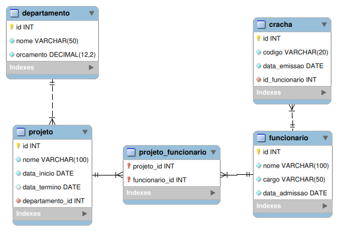

# Enterprise Project / Projeto Empresarial

## 📋 Índice / Table of Contents

- **🇧🇷 [Versão em Português](#-português)**
- **🇺🇸 [English Version](#-english)**

---

## 🇧🇷 Português

### Descrição
Sistema de gerenciamento empresarial desenvolvido em Java utilizando JPA/Hibernate para gerenciar departamentos, projetos, funcionários e crachás de uma empresa.

### Estrutura do Banco de Dados
O projeto implementa um sistema com as seguintes entidades:

- **Departamentos (Departments)**: Gerencia os departamentos da empresa
- **Projetos (Projects)**: Controla os projetos vinculados aos departamentos
- **Funcionários (Employees)**: Cadastro de funcionários
- **Crachás (Badges)**: Sistema de crachás para os funcionários

### Diagrama do Banco de Dados
<div align="center">

</div>

### Tecnologias Utilizadas
- **Java 24**
- **JPA/Hibernate 7.0.0.Final**
- **MySQL Connector 9.3.0**
- **Maven** para gerenciamento de dependências

### Pré-requisitos
- Java 24 ou superior
- MySQL Server
- Maven

### Configuração do Banco de Dados

#### Configurações MySQL:
- **Porta**: 3307
- **Base de Dados**: `enterprise_project`
- **Usuário**: `user_enterprise_project`
- **Senha**: `password`
- **Host**: localhost

#### Criação do Banco e Usuário:
```sql
-- Criar a base de dados
CREATE DATABASE enterprise_project;

-- Criar usuário e conceder permissões
CREATE USER 'user_enterprise_project'@'localhost' IDENTIFIED BY 'password';
GRANT ALL PRIVILEGES ON enterprise_project.* TO 'user_enterprise_project'@'localhost';
FLUSH PRIVILEGES;
```

### Como Executar

1. **Clone o repositório**
```bash
git clone [URL_DO_REPOSITORIO]
cd EnterpriseProject
```

2. **Configure o MySQL**
   - Certifique-se de que o MySQL esteja rodando na porta 3307
   - Execute os comandos SQL acima para criar o banco e usuário

3. **Compile e execute o projeto**
```bash
mvn clean compile
mvn exec:java -Dexec.mainClass="edu.br.ifpr.EnterpriseProject"
```

### Funcionalidades
- **Seeding automático**: O projeto inclui classes Seeder que populam automaticamente o banco com dados de exemplo
- **Relacionamentos JPA**: Implementa relacionamentos One-to-Many e Many-to-Many entre as entidades
- **Cascata**: Configurado para persistir entidades relacionadas automaticamente

### Estrutura do Projeto
```
src/
├── main/
│   ├── java/
│   │   └── edu/br/ifpr/
│   │       ├── EnterpriseProject.java (Classe principal)
│   │       ├── model/entity/
│   │       │   ├── Departments.java
│   │       │   ├── Projects.java
│   │       │   ├── Employees.java
│   │       │   └── Badges.java
│   │       └── seeder/
│   │           ├── DatabaseSeeder.java
│   │           ├── FullDatabaseSeeder.java
│   │           └── [outros seeders...]
│   └── resources/
│       └── META-INF/
│           └── persistence.xml
```

---

## 🇺🇸 English

### Description
Enterprise management system developed in Java using JPA/Hibernate to manage departments, projects, employees, and badges of a company.

### Database Structure
The project implements a system with the following entities:

- **Departments**: Manages company departments
- **Projects**: Controls projects linked to departments
- **Employees**: Employee registration
- **Badges**: Badge system for employees

### Database Diagram
<div align="center">

</div>
### Technologies Used
- **Java 24**
- **JPA/Hibernate 7.0.0.Final**
- **MySQL Connector 9.3.0**
- **Maven** for dependency management

### Prerequisites
- Java 24 or higher
- MySQL Server
- Maven

### Database Configuration

#### MySQL Settings:
- **Port**: 3307
- **Database**: `enterprise_project`
- **User**: `user_enterprise_project`
- **Password**: `password`
- **Host**: localhost

#### Database and User Creation:
```sql
-- Create database
CREATE DATABASE enterprise_project;

-- Create user and grant permissions
CREATE USER 'user_enterprise_project'@'localhost' IDENTIFIED BY 'password';
GRANT ALL PRIVILEGES ON enterprise_project.* TO 'user_enterprise_project'@'localhost';
FLUSH PRIVILEGES;
```

### How to Run

1. **Clone the repository**
```bash
git clone [REPOSITORY_URL]
cd EnterpriseProject
```

2. **Configure MySQL**
   - Make sure MySQL is running on port 3307
   - Execute the SQL commands above to create the database and user

3. **Compile and run the project**
```bash
mvn clean compile
mvn exec:java -Dexec.mainClass="edu.br.ifpr.EnterpriseProject"
```

### Features
- **Automatic seeding**: The project includes Seeder classes that automatically populate the database with sample data
- **JPA relationships**: Implements One-to-Many and Many-to-Many relationships between entities
- **Cascade**: Configured to persist related entities automatically

### Project Structure
```
src/
├── main/
│   ├── java/
│   │   └── edu/br/ifpr/
│   │       ├── EnterpriseProject.java (Main class)
│   │       ├── model/entity/
│   │       │   ├── Departments.java
│   │       │   ├── Projects.java
│   │       │   ├── Employees.java
│   │       │   └── Badges.java
│   │       └── seeder/
│   │           ├── DatabaseSeeder.java
│   │           ├── FullDatabaseSeeder.java
│   │           └── [other seeders...]
│   └── resources/
│       └── META-INF/
│           └── persistence.xml
```

### Sample Data
When you run the application, it will automatically create and populate the database with:
- 2 Departments (IT and HR)
- 2 Projects (Telemetry Implementation and HR Task Force)
- 2 Employees (Rafael de Sá and Vanessa)
- 3 Badges for the employees

### Entity Relationships
- **Department** ↔ **Project**: One-to-Many (One department can have multiple projects)
- **Employee** ↔ **Badge**: One-to-Many (One employee can have multiple badges)
- **Project** ↔ **Employee**: Many-to-Many (Projects can have multiple employees, employees can work on multiple projects)

---

## 📝 Notes / Notas

- The application uses `CascadeType.ALL` for some relationships, meaning related entities are automatically persisted/updated/deleted.
- Database schema is automatically created on application startup (`jakarta.persistence.schema-generation.database.action=create`).
- Make sure to adjust MySQL port and credentials in `persistence.xml` if needed.

---

## 🤝 Contributing / Contribuindo

Feel free to submit issues and pull requests to improve this project.
Sinta-se à vontade para submeter issues e pull requests para melhorar este projeto.